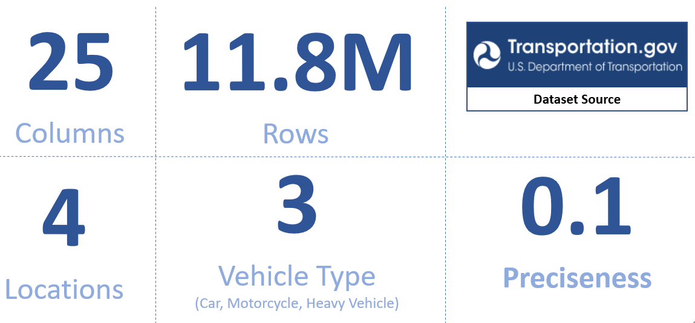
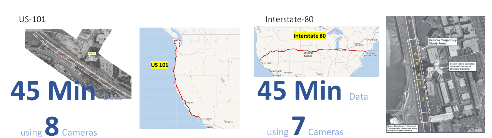
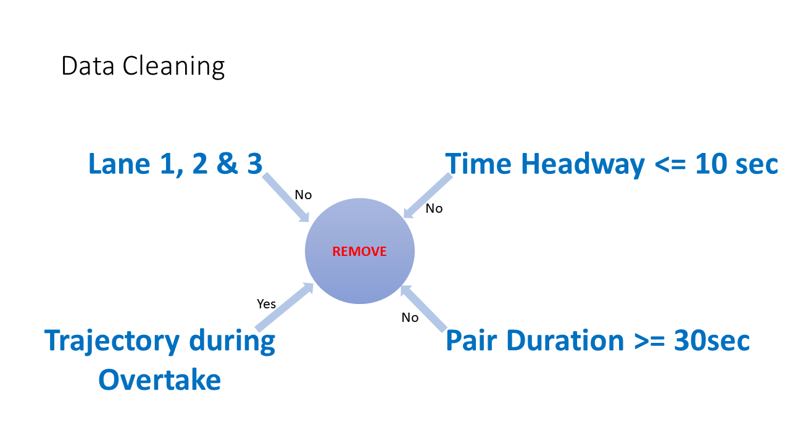
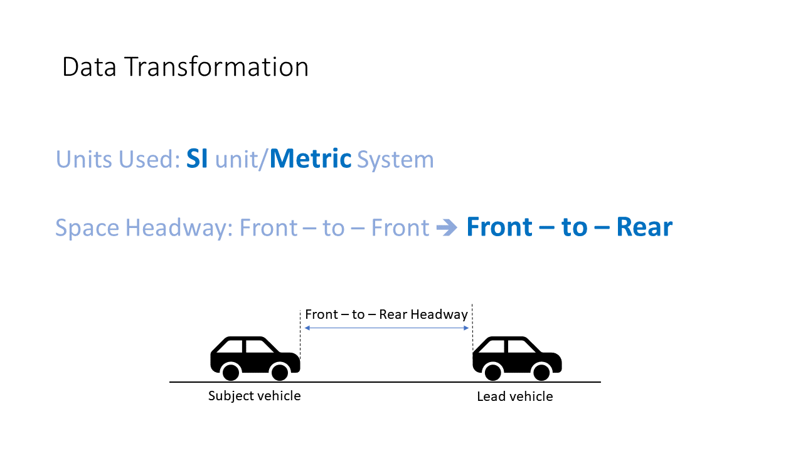

 
  

<h1 align="center"> Data Driven Car Following Model </h1>
<h3 align="center"> A Comparison and Application for Random Forest, CNN and KNN Car Following models to predict Acceleration and calculate Subject Vehicle Trajectory</h3>  

 

 
   width="70%" height="70%">

<!-- TABLE OF CONTENTS -->
<h2 id="table-of-contents"> :book: Table of Contents</h2>

  
Table of Contents

  <ol>
    <li>
      <a href="#about-the-project"> ➤ About The Project</a>
      <ul>
        <li><a href="#Problem-statement">Problem Statement</a></li>
        <li><a href="#Proposed-Solution">Proposed Solution</a></li>
      </ul>
    </li>
    <li><a href="#prerequisites"> ➤ Prerequisites</a></li>
    <li><a href="#folder-structure"> ➤ Folder Structure</a></li>
    <li><a href="#dataset"> ➤ Dataset</a></li>
    <li><a href="#roadmap"> ➤ Roadmap</a></li>
    <li>
      <a href="#preprocessing"> ➤ Preprocessing</a>
      <ul>
        <li><a href="#Data-Cleanup">Data Cleanup</a></li>
        <li><a href="#Data-Transormation">Data Transormation</a></li>
      </ul>
    </li>
    <li><a href="#results-and-discussion"> ➤ Results and Discussion</a></li>
    <li><a href="#Re-Create"> ➤ Steps to Re-Create</a></li>
    <li><a href="#TroubleShoot"> ➤ TroubleShoot</a></li>
    <li><a href="#references"> ➤ References</a></li><!-- pending -->
    <li><a href="#contributors"> ➤ Contributors</a></li>
    
  </ol>

<!-- ABOUT THE PROJECT -->
<h2 id="about-the-project"> :pencil: About The Project</h2>

 
  This project aims to understand and explore trajectories of various Car Following Models that predict Acceleration. The raw NGSIM data will be preprocessed to cleanup bad data and filter only valid pairs that would help train the model on I-80 and US-101 Highways. 
  The goal is to compare and evaluate the performance of different Models (Random Forest, k Nearest Neighbors, and CNN) and discuss the trajectories along with their R^2 and RMSE.

<!-- PRE-PROCESSED DATA -->
<h2 id="Problem-statement"> :diamond_shape_with_a_dot_inside: Problem Statement</h2>

 

* Very few data driven models predict acceleration accurately. 
*  Even with good RMSE scores, the trajectories do not match or aren’t displayed.
* The papers either falsely claim good acceleration predictions or completely avoid mentioning it.

<!-- PRE-PROCESSED DATA -->
<h2 id="Proposed-Solution"> :diamond_shape_with_a_dot_inside: Proposed Solution</h2>

 

 - Create and compare Data Driven car following model using NGSIM dataset.
 - Display and compare trajectories along with R2 and RMSE.

<!-- PREREQUISITES -->
<h2 id="prerequisites"> :fork_and_knife: Prerequisites</h2>

  
  
  

<!--This project is written in Python programming language.  -->
The following open source packages are used in this project:
* Numpy
* Pandas
* TensorFlow
* Keras
* Matplotlib
* Sklearn
* pathlib
* random
* seaborn
* pickle
* streamlit

<!-- :paw_prints:-->
<!-- FOLDER STRUCTURE -->
<h2 id="folder-structure"> :cactus: Folder Structure</h2>

    datadrivencarfollowing-v1
    .
    │
    ├── APP
    │   ├── Demo.py
    │   ├── Prediction_set_Predited_data_0.1.csv
    │   ├── Prediction_set_Predited_data_0.2.csv
    │   ├── Prediction_set_Predited_data_0.3.csv
    │   ├── Prediction_set_Predited_data_0.5.csv
    │   ├── Prediction_set_Predited_data_1.csv
    │   ├── Prediction_set_Predited_data_2.csv
    │   └── Prediction_set_Predited_data_4.csv
    ├── data
    │   ├── all Datasets required for code or created by code.
    │   └── Next_Generation_Simulation__NGSIM__Vehicle_Trajectories_and_Supporting_Data.csv ==> Required Input NGSIM file name to recreate
    ├── docs
    │   └── Data Dictionary.xlsx
    ├── results
    │   ├── Car Following Model.pptx
    │   ├── Data-Cleanup_Transformation_Test_Train_Split.html
    │   ├── Error Metrics.xlsx
    │   ├── Model Application-CNN.html
    │   ├── Model Application-KNN.html
    │   ├── Model Application-Random Forest.html
    │   ├── Predict All Models-Prediction Set.html
    │   ├── Predict CNN-Prediction Set.html
    │   ├── Predict CNN-Prediction Set_files
    │   ├── Predict CNN-Test Dataset.html
    │   ├── Predict KNN-Prediction Set.html
    │   ├── Predict KNN-Test Dataset.html
    │   ├── Predict Random Forest-Prediction Set.html
    │   ├── Predict Random Forest-Test Dataset.html
    │   ├── Prediction Set-All Pairs(9) Trajectories for All models.html
    │   ├── Save Model for various Reaction Times-KNN.html
    │   ├── Save Model for various Reaction Times-Neural.html
    │   ├── Save Model for various Reaction Times-Random Forest.html
    │   ├── Visualize Prediction Sets.html
    │   └── Visualize Test Sets.html
    ├── scripts
    │   ├── Calculate R2 and RMSE.ipynb
    │   ├── Cleaned Data set Stats.ipynb
    │   ├── Data-Cleanup_Transformation_Test_Train_Split.ipynb
    │   ├── Ethics_Checklist_Group5_Section03.ipynb
    │   ├── Explanatory Plot ppt.ipynb
    │   ├── Model Application-CNN.ipynb
    │   ├── Model Application-KNN.ipynb
    │   ├── Model Application-Random Forest.ipynb
    │   ├── Predict All Models-Prediction Set.ipynb
    │   ├── Predict All Models-Test Set.ipynb
    │   ├── Predict CNN-Prediction Set.ipynb
    │   ├── Predict CNN-Test Dataset.ipynb
    │   ├── Predict KNN-Prediction Set.ipynb
    │   ├── Predict KNN-Test Dataset.ipynb
    │   ├── Predict Random Forest-Prediction Set.ipynb
    │   ├── Predict Random Forest-Test Dataset.ipynb
    │   ├── Prediction Plots_0.1 for ppt.ipynb
    │   ├── Prediction Plots_0.2 for ppt.ipynb
    │   ├── Prediction Plots_0.3 for ppt.ipynb
    │   ├── Prediction Plots_0.5 for ppt.ipynb
    │   ├── Prediction Plots_1 for ppt.ipynb
    │   ├── Save Model for various Reaction Times-KNN.ipynb
    │   ├── Save Model for various Reaction Times-Neural.ipynb
    │   ├── Save Model for various Reaction Times-Random Forest.ipynb
    │   ├── Visualize Prediction Sets.ipynb
    │   └── Visualize Test Sets.ipynb
    └── src
        ├── Cleanup.py
        ├── EDA.py
        ├── FileProcessing.py
        ├── ModelClass.py
        └── Tranformation.py

<!-- DATASET -->
<h2 id="dataset"> :floppy_disk: Dataset</h2>

 
  The dataset used in this project is called * Next Generation Simulation (NGSIM) * and it is publicly available on the U.S. Department of Transportation website. The NGSIM dataset consists of 25 columns and 11.8 million rows of vehicle trajectory data which was captured using a network of synchronized digital video cameras on 4 different locations (US 101, I-80, Peachtree, and Lankershim). The data contains the location of a vehicle at every one-tenth of a second, which gives the exact position of each vehicle relative to other vehicles. 
  A total of 3 different types of vehicle data can be found in this dataset, namely Car, Truck, and Motorcycle. Most of the data were taken from the two freeways i.e., US 101 and I-80, and among the three vehicle types, data on Cars is more as compared to Trucks and Motorcycles. Therefore, we decided to work on only the Freeways. After the Preliminary analysis, we found that some vehicle IDs are present in more than one location meaning that the data from all four locations were taken separately and then merged in a single file. Hence, we separated the data based on location to carry out data cleaning and data transformation and then merge them back. 

  

  

 _The NGSIM dataset is publicly available. Please refer to the [Link](https://www.opendatanetwork.com/dataset/data.transportation.gov/8ect-6jqj)_ 

<!-- ROADMAP -->
<h2 id="roadmap"> :dart: Roadmap</h2>

 
  We trained three models namely k-Nearest Neighbors, Random Forest, and CNN to predict Acceleration for Subject Vehicle and find rest of the trajectory.
  The goals of this project include the following:
<ol>
  <li>
    
 
      Clean and Transform the NGSIM Data 
    

  </li>
  <li>
    
 
      Train Random Forest, KNN and CNN on same Train Data. 
    

  </li>
  <li>
    
 
      Compare R2 and RMSE for the models. 
    

  </li>
  <li>
    
 
      Validate Vehicle Trajectories and compare with R2 and RMSE outcomes.
    

  </li>
</ol>

<!-- PREPROCESSING -->
<h2 id="preprocessing"> :hammer: Preprocessing</h2>

 
  The NGSIM (Next Generation Simulation) dataset includes vehicle trajectory details along with the information of Lead and Following vehicle IDs. Even though the dataset has been processed by the Transportation department there are quite a few instances of Bad Data and vehicle trajectories which wont help in training for a good Car following model. Thus, we have preprocessed the data as per below:
  

<!-- PRE-PROCESSED DATA -->
<h2 id="Data-Cleanup"> :diamond_shape_with_a_dot_inside: Data-Cleanup</h2>

 
  Below are the cleanup tasks that have been performed:

   - Remove all Vehicles which have bad Vehicle Length and Type. i.e. same vehicle having two vehicle Types in different pair information.
   - Remove first 5 seconds for a Pair when Lead Vehicle is overtaking. Last 5 from the pair which the vehicle is leaving(same vehicle was Subject in that scneario).
   - Remove Lane 4 and above as they are shoulders/ramps and exits. 
   - Remove trajectories which are less than 30 seconds. 
   - Remove vehicles with Time headway greater than 10 seconds. 

  

<h2 id="Data-Transormation"> :large_orange_diamond: Data Transformation</h2>

 
  Below are the transformation steps that have been followed:

   - Map Subject and Lead Vehicle information to have them on the same row. 
   - Convert the Feet information to Metric Metres.
   - Convert the Front - Front Space and Time Headway details to Lead Vehicle Rear Bumper to Subject Vehicle Front Bumper. 
   - Create per pair timing. 

  

<!-- RESULTS AND DISCUSSION -->
<h2 id="results-and-discussion"> :mag: Results and Discussion</h2>

  The overall accuracy score of personal and impersonal models are shown in the following tables. Some of the results we observed are similar to the results obtained by Weiss et.al and they are discussed below:  

<ul>
  <li>
    Random Forest with 150 Regressors had the best Trajectory. 
  </li>
  <li>
    KNN has the best results at hand with limited resources i.e. Local Machine.
  </li>
  <li>
    CNN has best R2 and RMSE but bad trajectories and missed prediction scales.
  </li>
  <li>
    All three models are able to meet the trajectory oscillations.
  </li>
</ul>

  

<h2 id="Re-Create"> :cactus: Re-Create Steps</h2>

Details of scripts and python files are mentioned at the end for quick reference.

Below Steps need to be followed to re-create the results or clone the project to run on new NGSIM version.
1. Clone the repo from git and open in your GUI of choice. 
2. Ensure that all the dependencies mentioned in  <a href="#prerequisites"> ➤ Prerequisites</a> are met. 
3. Environment.yml can be referenced for the packages and their versions. Below command can be used to clone the environment  
    (cb) $ conda env update --prefix ./env --file environment.yml --prune
4. Install the src directory which contains all the python classes required in the Jupyter notebooks:
    pip install -e .
5. The details of which script to run are mentioned below as per the need:
  1. Download NGSIM file from [here](https://data.transportation.gov/Automobiles/Next-Generation-Simulation-NGSIM-Vehicle-Trajector/8ect-6jqj) and place it in the data folder with name Next_Generation_Simulation__NGSIM__Vehicle_Trajectories_and_Supporting_Data.csv
  2. Execute script/Data-Cleanup_Transformation_Test_Train_Split.ipynb and it would Clean, transform and split the input NGSIM data into Train/Validate/Test/sample Prediction pairs. (These pairs would be differnet then ours based on random selection from the dataset, slight variations to the results and numbers could be observed)
    - The Division is 3 pairs each of >60 seconds car following trajectory for each vehicle combination Car-Car, Car-HV, HV-Car
    - Rest data is divided into 80/10/10 percentages. 
  3. Execute below scripts from scripts folder to train, fit and store the ML Models in the scripts folder. These can be validated against the time it took for us to run and the storage its taking in your system. If the variation is too much, NGSIM data may have changed. Refer the Data dictionary in the docs to validate.
   - Save Model for various Reaction Times-KNN.ipynb
   - Save Model for various Reaction Times-Neural.ipynb
   - Save Model for various Reaction Times-Random Forest.ipynb
  4. Once the models are saved in the scripts folder, move all the models from Scripts to Data folder manually, This is to ensure that you only do this once and even if the save model is executed multiple times the models arent over written.
  5. Depending upon which dataset Prediction is required, run the below files to exither Predict the Prediction Set or the entire Test Set. Prediction set is the small subset of 3 vehicle pairs to view the outputs. The names of the scripts are self explanatory to decide which one to run. Each run saves the corresponding files in the Data folder. 
   - Predict All Models-Prediction Set.ipynb 
   - Predict All Models-Test Set.ipynb
   - Predict CNN-Prediction Set.ipynb
   - Predict CNN-Test Dataset.ipynb
   - Predict KNN-Prediction Set.ipynb
   - Predict KNN-Test Dataset.ipynb
   - Predict Random Forest-Prediction Set.ipynb
   - Predict Random Forest-Test Dataset.ipynb
  6. Based upon the run of the above scripts the plots can be visualized 
   - Visualize Prediction Sets.ipynb ==>This would display all Prediction Set pairs trajectories. 
   - Visualize Test Sets.ipynb ==>This would display all Test Set pairs trajectories. 
  7. Execute the below Script to verify the RMSE and R2 for the Test set:
   - Calculate R2 and RMSE.ipynb
  8. Below scripts are not required to be run in order to generate the trajectory pairs, but would help in understanding and cloning the models if required. Each file is a standalone implementation of Fit, run predict for first pair from the test dataset. This can be tweaked to play with any of the Model:
    - Model Application-CNN.ipynb
    - Model Application-KNN.ipynb
    - Model Application-Random Forest.ipynb
  9. Below are the details to run the demo App:
    - open command prompt
    - run command: conda activate "environment name"
    - run command: cd "path to the APP folder"
    - run command: streamlit run Demo.py
  10. Other Scripts for reference:
   - Cleaned Data set Stats.ipynb ==> will provide stats for the cleaned dataset
   - Ethics_Checklist_Group5_Section03.ipynb =>Ethical Checklist for the Project. 

<h2 id="TroubleShoot"> :cactus: TroubleShoot Steps</h2>

Below are a few possible scenarios which may give you error, along with their probable solution

1. Imports dependencies fail in python files: Verify the versions match which are mentioned in the environment yml. tensor and keras had few dependencies which havent been fixed in the latest versions. 
2. src imports for Transformation /Cleanup or File Processing failing: This means the src module load has failed, backup option is add PYTHONPATH variable with the path of the src directory in the System Environment variables. This will manually add the src directory in your Python Path.
3. In case of Json error on any of the scripts, means that the file is incorrectly downloaded from github. In that case, entire git hub Repo should be downloaded rather than just 1 script. In case that still fails, try comparing the same script from either Alpha or Bravo branch in github, there might be minor changes else drop me an email and we will share the latest version of that script. 

<!-- REFERENCES -->
<h2 id="references"> :books: References</h2>

<ul>
  <li>
    
Matthew B. Kennel, Reggie Brown, and Henry D. I. Abarbanel. Determining embedding dimension for phase-space reconstruction using a geometrical construction. Phys. Rev. A, 45:3403–3411, Mar 1992.
    

  </li>
  <li>
    

      L. M. Seversky, S. Davis, and M. Berger. On time-series topological data analysis: New data and opportunities. In 2016 IEEE Conference on Computer Vision and Pattern Recognition Workshops (CVPRW), pages 1014–1022, 2016.
    

  </li>
  <li>
    

      Floris Takens. Detecting strange attractors in turbulence. In David Rand and Lai-Sang Young, editors, Dynamical Systems and Turbulence, Warwick 1980, pages 366–381, Berlin, Heidelberg, 1981. Springer Berlin Heidelberg.
    

  </li>
  <li>
    

      Guillaume Tauzin, Umberto Lupo, Lewis Tunstall, Julian Burella P´erez, Matteo Caorsi, Anibal Medina-Mardones, Alberto Dassatti, and Kathryn Hess. giotto-tda: A topological data analysis toolkit for machine learning and data exploration, 2020.
    

  </li>
  <li>
    

      G. M. Weiss and A. E. O’Neill. Smartphone and smartwatchbased activity recognition. Jul 2019.
    

  </li>
  <li>
    

      G. M. Weiss, K. Yoneda, and T. Hayajneh. Smartphone and smartwatch-based biometrics using activities of daily living. IEEE Access, 7:133190–133202, 2019.
    

  </li>
  <li>
    

      Jian-Bo Yang, Nguyen Nhut, Phyo San, Xiaoli li, and Priyadarsini Shonali. Deep convolutional neural networks on multichannel time series for human activity recognition. IJCAI, 07 2015.
    

  </li>
</ul>

<!-- CONTRIBUTORS -->
<h2 id="contributors"> :scroll: Contributors</h2>

  :mortar_board: <i>All participants in this project are Student of Post Graduate Diploma in <a href="https://www.stclaircollege.ca/programs/data-analytics-business">Data Analytics for Business</a> <b>@</b> <a href="https://www.stclaircollege.ca/">St Clair College</a></i>    
   
  :boy: <b>Vineet Dhamija</b>  
  &nbsp;&nbsp;&nbsp;&nbsp;&nbsp; Email: <a>VD17@myscc.ca</a>  
  &nbsp;&nbsp;&nbsp;&nbsp;&nbsp; GitHub: <a href="https://github.com/VineetDhamija">@ma-VineetDhamija</a>  

  :boy: <b>Neel Chaudhari</b>  
  &nbsp;&nbsp;&nbsp;&nbsp;&nbsp; Email: <a>NC57@myscc.ca</a>  
  &nbsp;&nbsp;&nbsp;&nbsp;&nbsp; GitHub: <a href="https://github.com/neelschaudhari000">@ma-neelschaudhari000</a>  

  :boy: <b>Rakesh Singh</b>  
  &nbsp;&nbsp;&nbsp;&nbsp;&nbsp; Email: <a>rs334@myscc.ca</a>  
  &nbsp;&nbsp;&nbsp;&nbsp;&nbsp; GitHub: <a href="https://github.com/rakesh894">@ma-rakesh894</a>  
  
  :boy: <b>Umair Durrani</b>  
  &nbsp;&nbsp;&nbsp;&nbsp;&nbsp; Email: <a>UDURRANI@stclaircollege.ca</a>  
  &nbsp;&nbsp;&nbsp;&nbsp;&nbsp; GitHub: <a href="https://github.com/durraniu">@ma-durraniu</a>  

 
✤ <i>This was the final project for the course DAB402- Capstone (Summer 2022), at <a href="https://www.stclaircollege.ca/">St Clair College</a><i>